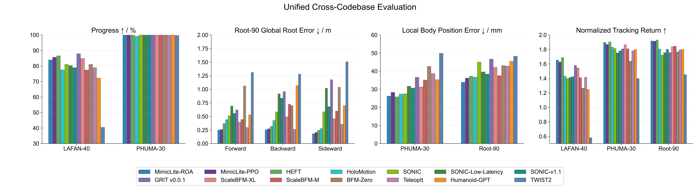

# sim2real

root project 负责 inference、tracking policy，以及 MuJoCo 的 sim / sim2real runtime。Pico / XR teleoperation 工具请使用 `venv/pico`。

English version: [README.md](./README.md)

Full documentation: [https://egalahad.github.io/sim2real/](https://egalahad.github.io/sim2real/)

如果你在找 HDMI 的部署栈，请看 [hdmi tag](https://github.com/EGalahad/sim2real/tree/hdmi)。

## Runtime Artifacts

大文件不放在 git 里。先从共享的
[sim2real artifacts](https://drive.google.com/drive/folders/1lrPyiiy7anyG3P4wHNIQQQlydboLPd9e)
下载，把 `checkpoints/` 和 `third_party/` 放到 repo 根目录。

目录结构和 onboard 依赖说明见 [Download Artifacts](./docs/artifacts.md)。

## 快速开始

```bash
uv sync --extra inference-cpu
```

在 G1 上安装或修复环境时，可以调用 repo 内置的 Codex skill
`$configure-g1-sim2real`；它位于 `.agents/skills/configure-g1-sim2real`。

运行离线动作跟踪（sim2sim）：

```bash
uv run sim2real/sim_env/base_sim.py --robot g1
uv run sim2real/rl_policy/tracking.py \
  --robot g1 \
  --policy_config checkpoints/mimic-lite/roa/policy.yaml
```

两个进程都启动后，在 policy 终端按 `]` 开始跟踪，然后打开 `base_sim.py` 打印出来的 mjviser URL。虚拟 gantry / elastic band 的开关和长度在 viewer UI 里调。

## Migrating to sim2real

这个 repo 内置了一个 Codex skill，用来把外部训练 codebase 里的 policy 适配到 `sim2real`：

```text
.agents/skills/adapt-policy-to-sim2real
```

已经转好的 checkpoints 统一放在共享的
[sim2real artifacts](https://drive.google.com/drive/folders/1lrPyiiy7anyG3P4wHNIQQQlydboLPd9e)
目录里。

目前已经支持的 adapted / distributed checkpoint：

| Policy family | Config path(s) | 说明 |
| --- | --- | --- |
| MimicLite-ROA | `checkpoints/mimic-lite/roa/policy.yaml` | 最新 16x16384 PPO-ROA student release。 |
| MimicLite-PPO | `checkpoints/mimic-lite/ppo/policy.yaml` | 最新 16x16384 Huge PPO release。 |
| HEFT | `checkpoints/heft` | PMG 和 compliance 两个版本。 |
| HoloMotion v1.4.0 | `checkpoints/holomotion/v1_4_0/policy.yaml` | 使用官方未修改 ONNX：[HorizonRobotics/HoloMotion_models](https://huggingface.co/HorizonRobotics/HoloMotion_models/resolve/main/HoloMotion_motion_tracking_model_v1.4.0/exported/model_14000.onnx)，下载后放到 `checkpoints/holomotion/v1_4_0/policy.onnx`。 |
| SONIC release | `checkpoints/sonic/release` | Release G1 和 SMPL encoder variants。 |
| SONIC low-latency | `checkpoints/sonic/low_latency` | Low-latency G1 和 SMPL variants。 |
| SONIC v1.1 | `checkpoints/sonic/v1_1/g1/policy.yaml` | 使用 heading-normalized reference orientation 的 G1 policy。 |
| GRIT v0.0.1 | `checkpoints/grit/v0_0_1/policy.yaml` | 九帧参考上下文和十帧本体感知历史。 |
| ScaleBFM | `checkpoints/scalebfm` | [WeishuaiZeng/ScaleBFM](https://huggingface.co/WeishuaiZeng/ScaleBFM) 的 Humanoid Transformer XL 和 M ONNX exports。 |
| BFM-Zero | `checkpoints/bfm-zero/exp_lafan40-100style_update_z10/policy.yaml` | Latent-conditioned motion tracker。 |
| TeleopIT | `checkpoints/teleopit/policy.yaml` | TeleopIT policy wrapper。 |
| Humanoid-GPT | `checkpoints/humanoid-gpt/policy.yaml` | Humanoid-GPT policy wrapper。 |
| TWIST2 | `checkpoints/twist2/policy.yaml` | TWIST2 policy wrapper。 |



图中使用 14 个 policy variants 的全新结果，数据集为 LAFAN-40、PHUMA-30
和清洗后的 Root-90。Root-90 每段沿标注的前进、后退或侧移方向持续运动，
root XY 位移为 1.5--3.0 m。

为了公平比较，我们报告每个 policy 所需的 motion-lookahead latency，并将
其定义为最远 future reference frame 对应的时间。所有数值均采用统一的
50 Hz reference-motion contract。

| Policy | MimicLite-ROA | MimicLite-PPO | HEFT | HoloMotion | SONIC | SONIC low-latency | SONIC v1.1 | GRIT v0.0.1 | ScaleBFM XL | ScaleBFM M | BFM-Zero | TeleopIT | Humanoid-GPT | TWIST2 |
| --- | ---: | ---: | ---: | ---: | ---: | ---: | ---: | ---: | ---: | ---: | ---: | ---: | ---: | ---: |
| Motion-lookahead latency | 0.08 s | 0.08 s | 0.12 s | 0.20 s | 0.90 s | 0.18 s | 0.90 s | 0.26 s | 0.10 s | 0.10 s | 0.12 s | 0.00 s | 0.02 s | 0.00 s |

## 真机环境

机器人 SDK 不安装进通用 root 环境。G1 inline 部署使用
`uv sync --extra inference-cpu --extra robot-g1`。安装与部署命令见
[Robot I/O 模式](./docs/robot_io.md)。

Repo skills 统一放在 `.agents/skills/`，无需手动复制到
`~/.codex/skills/`。可以在 Codex 中显式调用
`$adapt-policy-to-sim2real`。

## 下一步

- [文档首页](https://egalahad.github.io/sim2real/zh-Hans/)
- [快速上手](https://egalahad.github.io/sim2real/zh-Hans/getting-started/overview)
- [Root Project Setup](https://egalahad.github.io/sim2real/zh-Hans/getting-started/root-project)
- [离线动作跟踪教程](https://egalahad.github.io/sim2real/zh-Hans/tutorials/offline-motion-tracking)
- [Pico Teleoperation 教程](https://egalahad.github.io/sim2real/zh-Hans/tutorials/pico-teleoperation)

## Citation

如果 sim2real 对你的研究有所帮助，请引用：

```bibtex
@misc{sim2real2026,
  author       = {{RoboParty Lab Team}},
  title        = {sim2real: A Lightweight and Modular Sim2sim and Sim2real Deployment Stack},
  year         = {2026},
  howpublished = {\url{https://github.com/EGalahad/sim2real}},
  note         = {Documentation: \url{https://egalahad.github.io/sim2real/}}
}
```


## SomaForce 部署

本仓库同时保留 HDMI student、Sonic nominal 与共享 SomaForce Cross residual 的部署契约。
详见 [SomaForce 部署说明](./docs/somaforce_deployment.md)。离线 replay、MuJoCo 和真机
使用同一个 DeploymentStack，只替换 RobotIO 后端；请按 offline replay、MuJoCo sim2sim、
nominal 真机、residual shadow、C0 parity、低 authority pilot 的顺序推进。

每个 task artifact 需要 manifest.json、nominal/residual ONNX、冻结 normalization 和
reference data。使用 configs/tasks/manifest.example.json 生成 manifest，并运行：

    python scripts/verify_artifacts.py artifacts/<task>/manifest.json

本地 `artifacts/hdmi_push_box/` 放置 HDMI student 和 Cross residual 两个 ONNX；
Git 会忽略模型二进制。
可以先运行组合层 smoke，再运行无界面的 MuJoCo 物理 smoke：

    python scripts/validate_onnx_bundle.py --student artifacts/hdmi_push_box/student.onnx --residual artifacts/hdmi_push_box/cross_residual.onnx --authority 0.0 --contact-gain 0.0 --shadow
    python scripts/mujoco_bundle_smoke.py --student artifacts/hdmi_push_box/student.onnx --residual artifacts/hdmi_push_box/cross_residual.onnx --control-steps 25 --authority 0.1 --contact-gain 0.2

后一个 smoke 当前明确使用零值合成 F/T token，只验证部署闭环和 MuJoCo 物理稳定性；
真实 push-box 接触传感器映射仍需单独接入。

真实的本地 G1+box 接触评测命令如下：

    python scripts/evaluate_push_box_mujoco.py --student artifacts/hdmi_push_box/student.onnx --residual artifacts/hdmi_push_box/cross_residual.onnx --output outputs/mujoco_eval/push_box_movable_full.npz --authority 0.05 --contact-gain 1.0

该评测会记录 `[T,2,6]` 的 wrist 局部坐标系 wrench 和 `[T,2,16,14]` 的 Cross token。
脚本保持 free root，并将碰撞几何限制为 wrist-to-box；
这属于传感器映射评测配置，不是完整 locomotion 或 Isaac acceptance。
## 自由基座 MuJoCo 评测与渲染

使用无约束 floating base 运行 HDMI student + Cross residual。评测遇到非有限状态或 pelvis 高度低于阈值会停止，并保存完整 `qpos/qvel`、真实接触 wrench 和 Cross token：

    python scripts/evaluate_push_box_mujoco.py --student artifacts/hdmi_push_box/student.onnx --residual artifacts/hdmi_push_box/cross_residual.onnx --output outputs/mujoco_eval/push_box_free_root_terminated.npz --authority 0.05 --contact-gain 1.0 --stop-on-instability --root-height-failure 0.45

使用离屏 MuJoCo 渲染视频；没有 `DISPLAY` 时脚本会自动选择 EGL：

    python scripts/render_push_box_mujoco.py --record outputs/mujoco_eval/push_box_free_root_terminated.npz --output outputs/mujoco_eval/push_box_free_root_terminated.mp4

如需完整模型碰撞几何检查（不使用 wrist-to-box 过滤），增加 `--all-contact-geometry`。
### 当前 free-root 对照结果

已增加 Cross scaffold-only 的 MuJoCo 适配，用于验证 privileged teacher baseline；它不属于 deployable student。当前对照结果：

- root-anchor 模式已取消，不再作为稳定性证据。
- `scaffold_reference_reset_free_root_100.npz`：free-root，约 55 步因 pelvis 高度跌倒。
- `student_nominal_aligned_lerp_200.npz`：student nominal，free-root 约 60 步跌倒。
- `student_cross_aligned_lerp_box_200.npz`：student + Cross residual，free-root 约 60 步跌倒。

所有后续结果均使用 free-root。当前 scaffold、student nominal、student + residual 均在约 40-55 个 control steps 内跌倒，说明仍需修复物理标定、资产几何和运行时语义对齐；不能通过 root anchor 或提高 residual authority 规避这一问题。

当前默认 residual artifact 为 task-onehot checkpoint 的导出：
`cross_residual.onnx`，来源 `segment_0023`（`iteration=733`、
`6,004,736` transitions、stage=`C2`）。旧的 segment-0079 图保留为
`cross_residual_segment0079.onnx`，仅用于 provenance 对照。

### HDMI nominal baseline 状态

当前基线只看 HDMI student，暂不把 Cross residual 纳入结论。HDMI 原生
Isaac headless rollout 使用 student finetune resume checkpoint 完成了
792-step push-box episode，`success=1.0`。对应 MuJoCo free-root 使用 HDMI
配置中的 `mujoco_physics_dt=0.002`、decimation=10 后，仍在 57 个 control
steps 触发 pelvis 高度保护。这说明当前主要是 MuJoCo 资产/动力学对齐失败，
不能据此否定 HDMI 蒸馏 student。

### 官方 HDMI tag runtime

headless harness 会从单独 checkout 的官方 HDMI tag 加载 policy 和 MuJoCo
模块，本仓库不 vendor upstream 源码。harness 同时覆盖了官方 tag 的默认端口
错误：`CommandSender` 使用 `55901`，MuJoCo bridge 使用 `5591`；本地统一为
`5591`。suitcase、door 和 task-specific push-box scene 的结果见下文。
使用的 upstream commit 是 `0007b02069a934324ec37b8e194e6a1c918e251b`。

当前 HDMI tag harness 的默认任务是 upstream suitcase 设置。upstream scene
使用 `SIMULATE_DT=0.005`，但本地训练的 suitcase checkpoint 明确记录了
`mujoco_physics_dt=0.002`。与 checkpoint 对齐的单个 motion cycle headless
复现命令如下：

模型、motion 和 mesh 大文件不会进入 Git。运行前从本地 HDMI 导出目录和
upstream `hdmi` tag checkout 准备这些文件：

```bash
git clone --depth 1 --branch hdmi https://github.com/EGalahad/sim2real.git ../sim2real-hdmi-upstream
mkdir -p artifacts/hdmi_move_suitcase/hdmi_tag assets/mujoco/reference/hdmi_suitcase
cp ../HDMI/scripts/exports/G1TrackSuitcase/policy-cbvbj5hd-final.onnx artifacts/hdmi_move_suitcase/hdmi_tag/student.onnx
cp ../HDMI/scripts/exports/G1TrackSuitcase/policy-cbvbj5hd-final.yaml artifacts/hdmi_move_suitcase/hdmi_tag/policy.yaml
cp ../HDMI/scripts/exports/G1TrackSuitcase/policy-cbvbj5hd-final.json artifacts/hdmi_move_suitcase/hdmi_tag/policy.json
cp ../HDMI/data/motion/g1/omomo/sub1_suitcase_011/motion.npz assets/mujoco/reference/hdmi_suitcase/motion.npz
cp ../HDMI/data/motion/g1/omomo/sub1_suitcase_011/meta.json assets/mujoco/reference/hdmi_suitcase/meta.json
```

预期 student ONNX SHA256 为
`1f847c8b648f09d1046518c05264b8a5c591aca1ba020554404b71bf919787ad`。

```bash
# 终端 1
python scripts/run_hdmi_tag_headless_sim.py \
  --seconds 12 --sim-dt 0.002 --initialize-motion-frame \
  --elastic-band-release-after 0 \
  --trajectory outputs/hdmi_tag_suitcase/trajectory.npz

# 在终端 1 启动后两秒内启动终端 2
python scripts/run_hdmi_tag_headless_policy.py --steps 472

MUJOCO_GL=egl python scripts/render_push_box_mujoco.py --scene suitcase \
  --scene-path ../sim2real-hdmi-upstream/data/robots/g1/g1_29dof_rubberhand-suitcase.xml \
  --record outputs/hdmi_tag_suitcase/trajectory.npz \
  --output outputs/hdmi_tag_suitcase/trajectory.mp4 --fps 500
```

`--initialize-motion-frame` 会同时从参考动作首帧初始化机器人和 suitcase。
`--elastic-band-release-after 0` 等价于策略启动后立刻按 `9`，同时清除最后一次
gantry 外力。当前本地对照中，未修改的 tag `0.005` timing 会跌倒；与 checkpoint
对齐的 `0.002` 可以完成第一个 suitcase 搬运周期。两者都不是硬件验收；全程
开启 gantry 的结果也不能表述为无辅助 locomotion 稳定性。

### 多任务 HDMI student sim2sim

同一套 harness 支持本地训练的 `push_door_hand`、`push_box` 和
`move_largebox` student。任务导出和 motion 文件从 `HDMI` 准备：

```bash
mkdir -p artifacts/hdmi_push_door_hand/hdmi_tag assets/mujoco/reference/hdmi_push_door_hand
cp ../HDMI/scripts/exports/G1PushDoorHand/policy-4ta6gpm0-final.{onnx,yaml,json} artifacts/hdmi_push_door_hand/hdmi_tag/
cp ../HDMI/data/motion/data_for_sim/push_door-hand-0828/{motion.npz,meta.json} assets/mujoco/reference/hdmi_push_door_hand/
mkdir -p artifacts/hdmi_push_box/hdmi_tag assets/mujoco/reference/push_box
cp ../HDMI/scripts/exports/G1PushBox/policy-3i8rdxsd-final.{onnx,yaml,json} artifacts/hdmi_push_box/hdmi_tag/
cp ../HDMI/data/motion/g1/push_box/push_box-VID_20250423_220958-light-high-adjust_root_height/{motion.npz,meta.json} assets/mujoco/reference/push_box/
mkdir -p artifacts/hdmi_move_largebox/hdmi_tag assets/mujoco/reference/hdmi_move_largebox
cp ../HDMI/scripts/exports/G1MoveLargeboxOmni/policy-cnrls2ul-final.{onnx,yaml,json} artifacts/hdmi_move_largebox/hdmi_tag/
cp ../HDMI/data/motion/g1/omomo/sub10_largebox_014/{motion.npz,meta.json} assets/mujoco/reference/hdmi_move_largebox/
```

在两个 headless 命令上分别增加 `--task push_door_hand`、`--task push_box`
或 `--task move_largebox` 运行一个 cycle。截至 2026-09-08，door 和 box
完成过一次任务动作；push-box 尚未证明跨多次启动可重复。large-box 已完成导出
和启动，但约 3 秒后 pelvis 高度下降，因此尚未通过。
